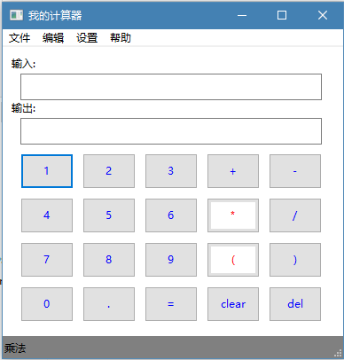

一个简单的计算器
***************************

这是初学python时的一个练手脚本，使用了：

    - wxpython
    - math

功能：

  - 初级
  - 中级
  - 高级
  - ... 等等

给一个编译后的: :download:`calculator.exe <../_static/calculator/calculator.exe>`

这是效果图

``源码:``

.. literalinclude:: ../_static/calculator/calculator.py
  :language: python
  :linenos:
