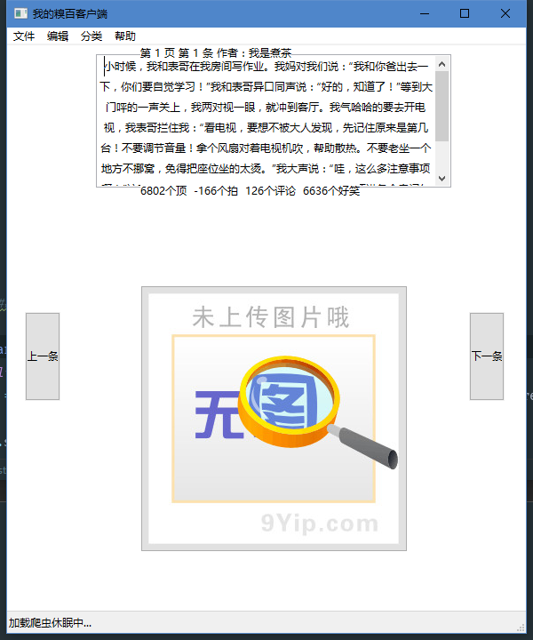

一个简单的糗百客户端
***************************

这是初学python时的一个练手脚本，使用了：

    - wxpython
    - requests
    - BeautifulSoup4
    - ...

功能：

  - 后台爬取数据
  - 预先加载
  - 图片也能显示
  - 类别切换
  - ... 等等

给一个编译后的: :download:`qb.exe <../_static/qb/qb.exe>`

这是效果图

``源码:``

.. literalinclude:: ../_static/qb/qb.py
  :language: python
  :linenos:
